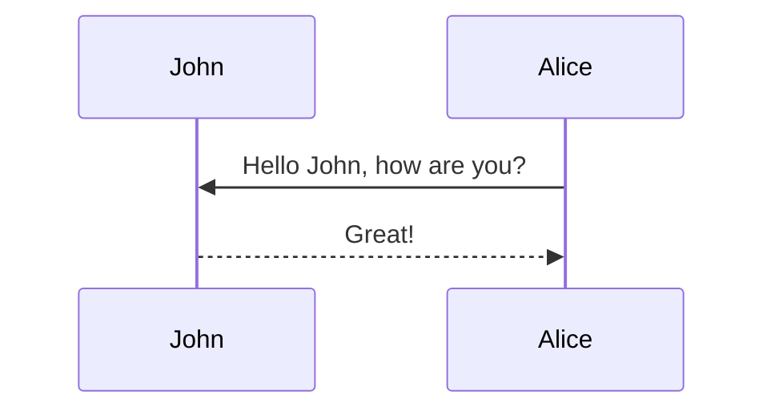

<style>
  /* 5. The INSTANT CMD K Killer and Alignment Fix */
  #search-toggle {
    font-size: 0 !important; /* Shrinks the text exactly to 0 pixels */
    color: transparent !important; /* Makes it completely invisible */
    display: inline-flex !important; 
    align-items: center !important; /* Forces perfect vertical alignment */
  }
  
  #search-toggle i, 
  #search-toggle svg {
    font-size: 1.25rem !important; /* Blows the magnifying glass back up to normal size */
    color: var(--global-text-color) !important; /* Restores its proper color */
    margin-top: 2px !important; /* Tiny tweak to level it perfectly with the moon/sun icon */
  }
</style>

This theme supports generating various diagrams from a text description using [mermaid](https://mermaid-js.github.io/mermaid/){:target="\_blank"}. Previously, this was done using the [jekyll-diagrams](https://github.com/zhustec/jekyll-diagrams){:target="\_blank"} plugin. For more information on this matter, see the [related issue](https://github.com/alshedivat/al-folio/issues/1609#issuecomment-1656995674).

To enable mermaid, you have to put the following in this post frontmatter:

```yml
mermaid:
  enabled: true
  zoomable: true
```

To disable the zooming feature, set `mermaid: zoomable` to `false`.

## Mermaid

The diagram below was generated by the following code:

````markdown

````


